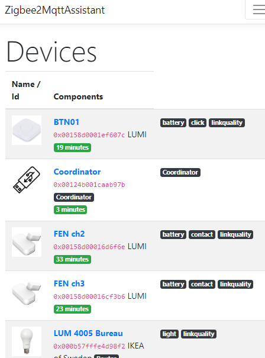
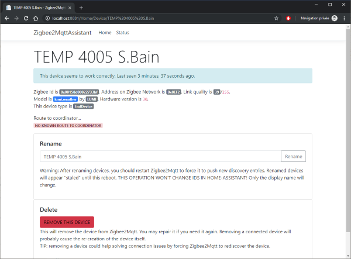
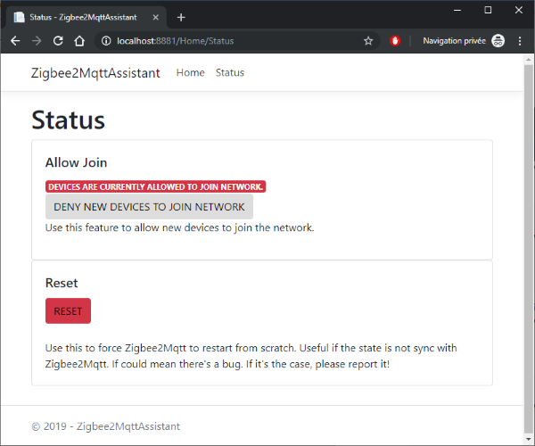

# Zibee2Mqtt Assistant
This project is a _Web GUI_ for the very good [Zigbee2Mqtt](https://www.zigbee2mqtt.io/) software
([github sources](https://github.com/Koenkk/zigbee2mqtt)).

3 ways to use it:
1. From compiled sources (here)
2. By starting a _docker container_ (not published yet)
3. By installing a _HASS-IO Add-on_ (not published yet)

[](https://dev.azure.com/yllibed/Zigbee2MqttAssistant/_build/latest?definitionId=4&branchName=master)
[](https://hub.docker.com/r/carldebilly/zigbee2mqttassistant)

# Screenshots





# Installation

## OPTION 1 - Installing as `HASS.IO` Add-on
1. Add the following repository url in HASS.IO:
   ```
   https://github.com/yllibed/hassio
   ```
2. Install Zigbee2Mq2tt
3. Configure your credentials for your MQTT server
4. Enjoy!

> **IMPORTANT** The current version only works on Linux / `amd64` architecture. More architectures will be available soon. Please open an issue if you need another architecture.

## OPTION 2 - Installing from docker
Run the following command by replacing `<mqttserver>`, `<mqttusername>`, `<mqttpassword>` with your correct values.
```bash
docker run -p 8880:80 -e Z2MA_SETTINGS__MQTTSERVER=<mqttserver> -e Z2MA_SETTINGS__MQTTUSERNAME=<mqttusername> -e Z2MA_SETTINGS__MQTTPASSWORD=<mqttpassword> --restart always carldebilly/zigbee2mqttassistant:linux-x64
```
> **draft note**: the environment variables will change in the future and it will
> be possible to specify a configuration file in future versions.

## OPTION 3 - Installing from sources & compiling using Visual Studio
1. Compile the solution file
2. Adjust settings in `appsettings.json` for your MQTT connection

# Settings

You can refer to [`Settings.cs` file](Zigbee2MqttAssistant/Models/Settings.cs) for more information
on allowed settings.

# Features
* Display all joined devices, event those unsupported by Zigbee2Mqtt
* Display staled devices
* Let you rename a device easily
* Let you remove a device easily
* Activate / deactivate ALLOW JOIN on Zigbee - no need to setup virtual switches in HA just for that.

# Roadmap
* [X] Build a CI + publish to docker hub
* [X] Shorter environment variables + config file (for docker image)
* [X] Create a `HASS.IO` add-on
  * [ ] Support for `HASS.IO` Ingress
  * [ ] Automatic update of repo on new version
* [ ] Support _Zigbee Bindings_ & _groups_
* [ ] Better display of "routes to coordinator"
* [ ] Improve UI

# Requirements
* You need a running installation of `Zigbee2Mqtt` v1.5.0+
  * Developped & tested with Zigbee2Mqtt v1.5.1
* Simple MQTT connection with username/password (TLS supported)
  * Client certificates not supported yet - open an issue if your need it.
* Zigbee2Mqtt required settings:
  * Home Assistant Discovery **MUST** be activated - event if you're not using it.
    This shouldn't have any side effect to your installation.

    **AN ACTUAL INSTALLATION OF HOME ASSISTANT IS NOT REQUIRED**

     To activate: `homeassistant: true` in Zigbee2Mqtt configuration
  * `last_seen` should be set to `ISO_8601`. Not required, but you'll have a better experience when activated.

# Contributing
* If you have suggestions or find bugs, don't hesitate to open and issue here, on Github.
* **PULL REQUESTS** are welcome! Please open an issue first and link it to your PR. If you're
  unsure about how to implement a feature, we should discuss it in the issue first.